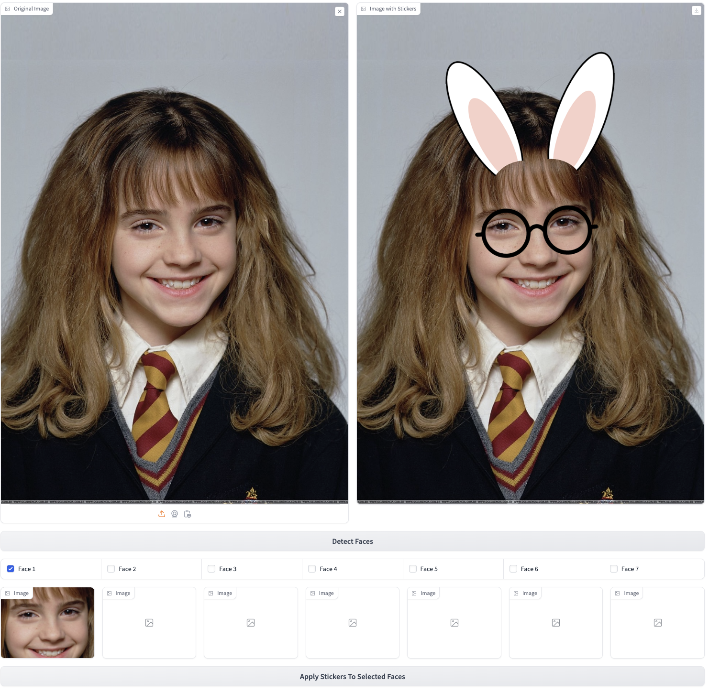
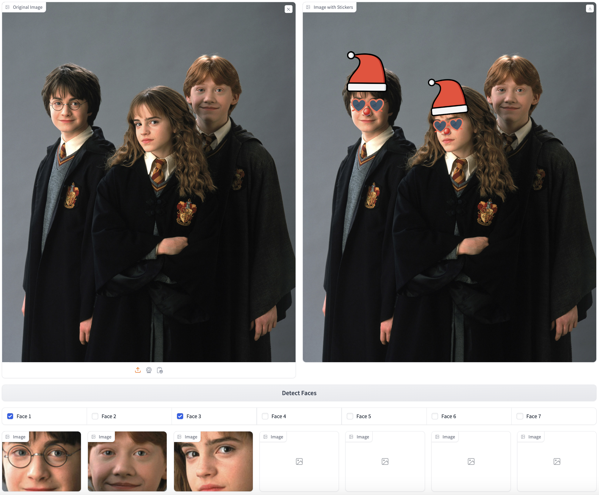
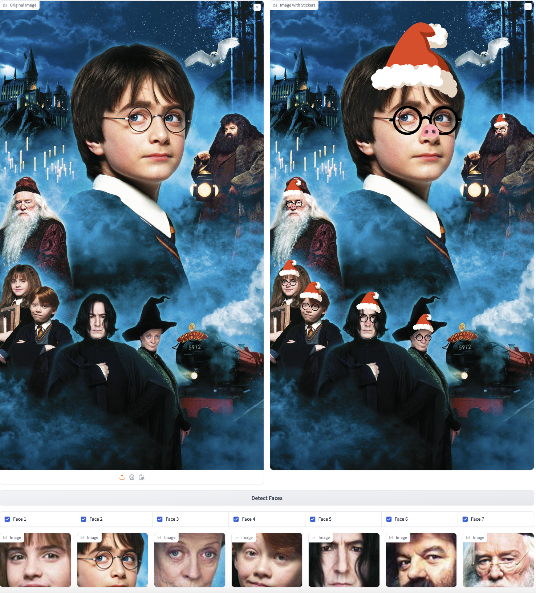
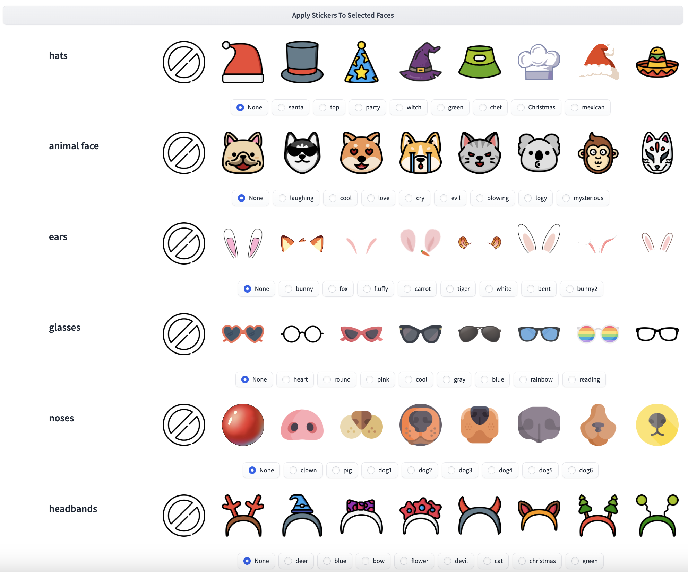
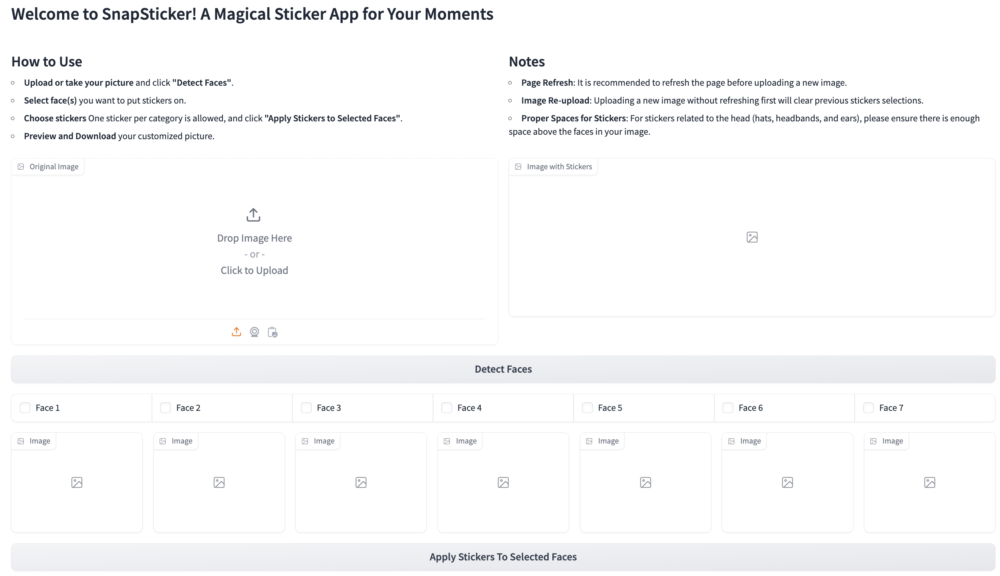

# SnapSticker
## Get started
** Install dependencies
```bash
conda env create -f conda.yaml 
```

SnapSticker is an advanced image processing application that allows users to enhance digital photographs by applying customizable stickers to faces detected within the images. This application leverages computer vision algorithms to identify and analyze facial landmarks, providing precise placement of various sticker categories like hats, glasses, animal faces, ears, headbands, and noses.

## Features

- **Face Detection**: Accurately detects and identifies up to seven faces in a single image.
- **Feature Recognition**: Analyzes key facial landmarks using an 81-landmark shape predictor model.
- **Customizable Stickers**: Offers a wide range of stickers tailored to the contours and orientation of each face.
- **Multi-Face Support**: Users can apply stickers to multiple faces simultaneously, making it ideal for group photos.
- **Interactive User Interface**: Provides a user-friendly interface that allows real-time preview and adjustments.
- **Image Download**: Allows users to easily download their edited images.

## Technologies Used

- **Python 3.10**
- **Dlib**: Used for face detection and facial landmark recognition.
- **OpenCV**: Handles image editing tasks such as resizing, color transitions, and overlays.
- **Gradio**: Provides the web-based user interface for uploading images and applying stickers.

## Usage

1. **Upload an image and click "Detect Face":**
    - The app will detect faces and display them for customization.
2. **Select Faces:**
    - Select the face(s) you want to apply stickers on.
3. **Apply stickers:**
    - Select stickers from the provided categories and apply them to the selected faces.
4. **Preview and edit:**
    - Use the real-time preview feature to see the stickers before finalizing the image.
5. **Download the edited image:**
    - Once satisfied with the customization, download the image.
  
## Example Usage
- An example of one person's photo with two types of stickers applied.
  
- An example of a group photo with three people, where one person's head is tilted, two faces are selected, and three types of stickers are applied.
  
- An example of a group photo with seven people, where some faces are tilted, some are larger while others are smaller, and some individuals have beards or hats. Three types of stickers are applied.
  
- Stickers Library
  
- User-Friendly Interactive Interface
  

## Sticker Library

The sticker library is divided into six categories:
- **Animal Faces**
- **Ears**
- **Glasses**
- **Hats**
- **Headbands**
- **Noses**

Each category offers a variety of stickers that can be applied to individual or multiple faces within a single image.


## Acknowledgements

- **Dlib**: For providing the robust tools for face detection and landmark recognition.
- **OpenCV**: For offering comprehensive image processing functions.
- **Gradio**: For enabling rapid interface deployment and interaction.
- **Flaticon**: For sourcing the sticker designs.

